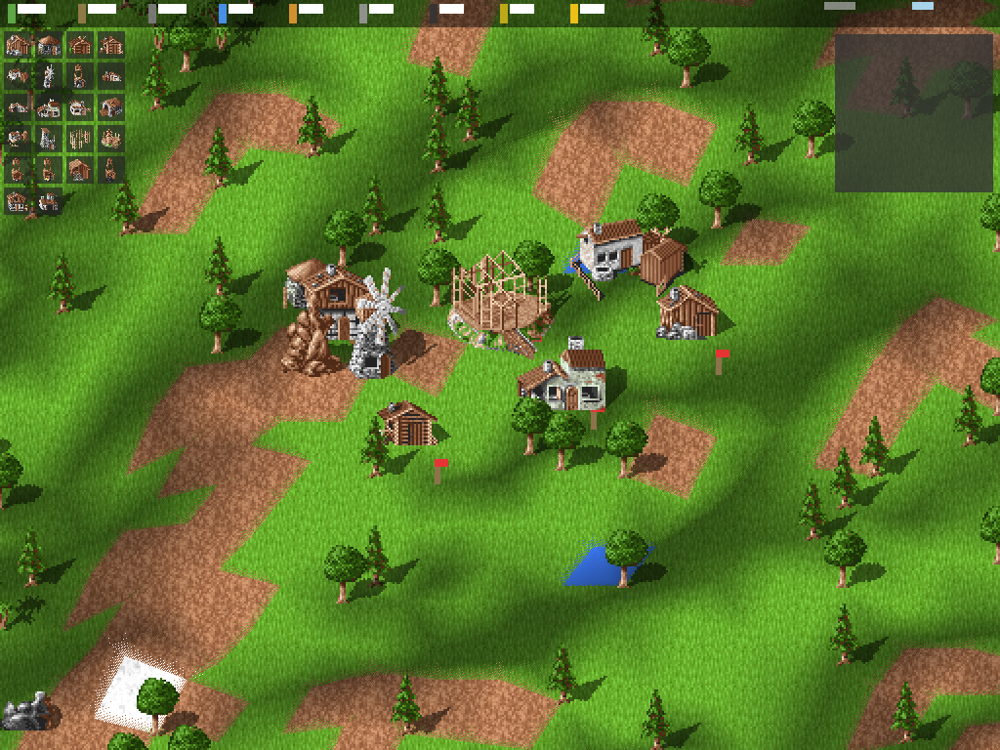
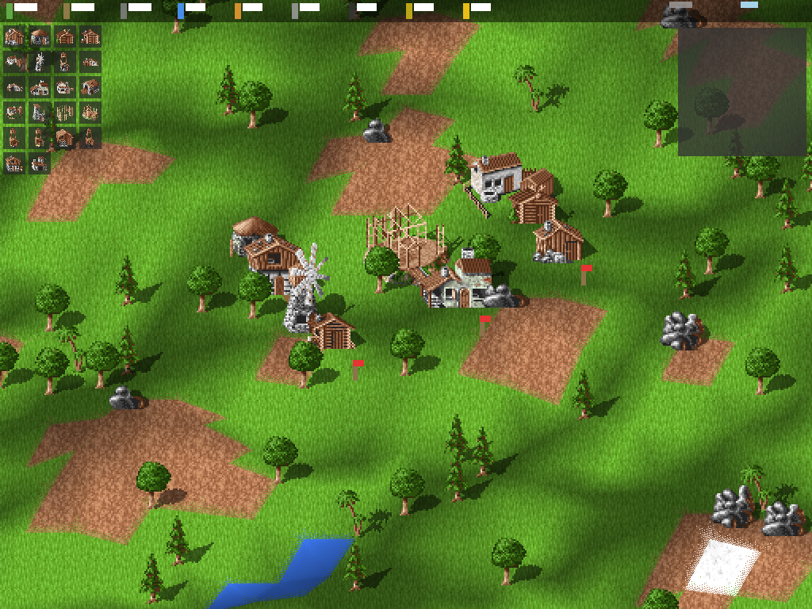
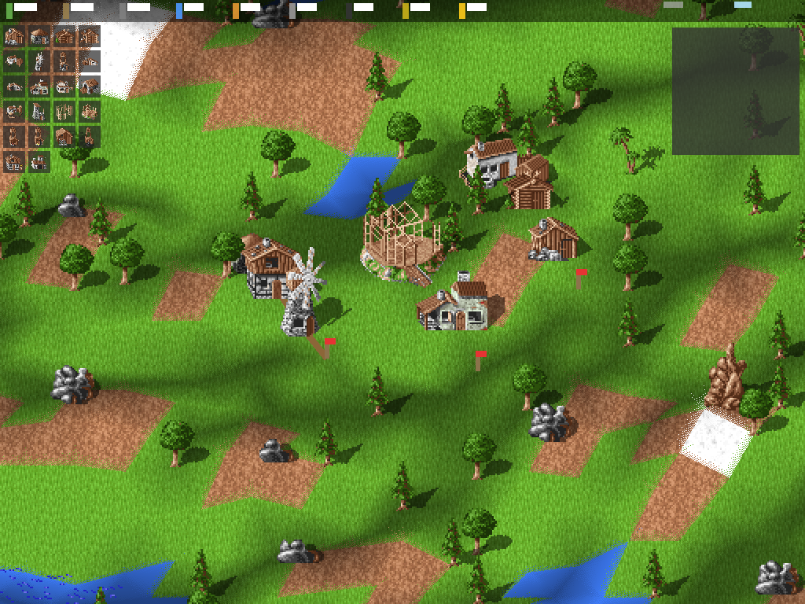
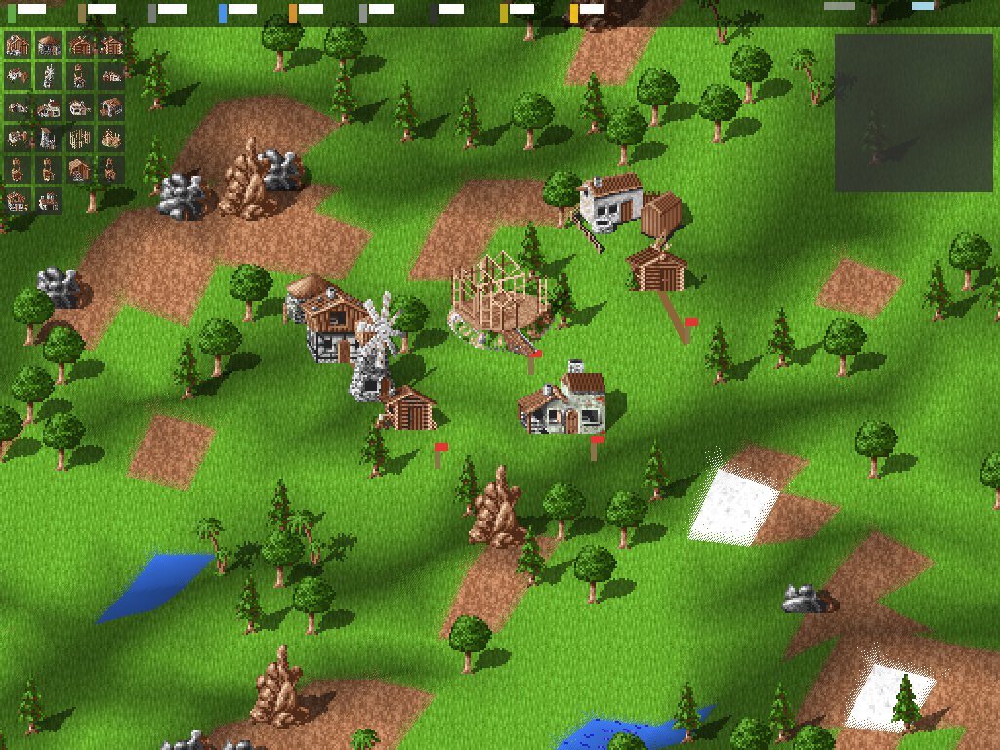
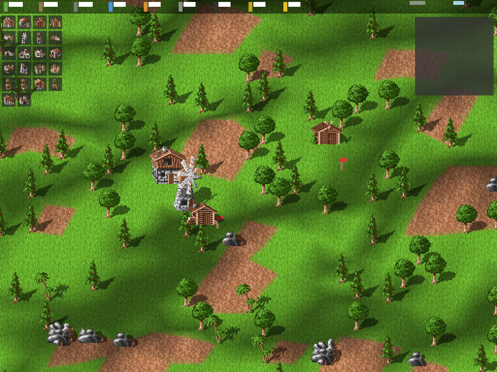

# Custom Map Sizes

The game supports configurable map sizes supplied at startup, ranging from the
classic **64×64** Settlers map up to **1024×1024** (over one million tiles).

## Usage

```bash
# Default (64×64, the classic Settlers size)
zig build run

# Any of these forms set the map size:
./zig-out/bin/freeserf --map-size 256 256
./zig-out/bin/freeserf --map-size=256x256
./zig-out/bin/freeserf --map-w 128 --map-h 256
./zig-out/bin/freeserf --help
```

Sizes outside the supported range are clamped to `[64, 1024]` and a notice is
printed. The bounds live in `src/core/Map.zig` as `MIN_SIZE` / `MAX_SIZE`.

## Implementation notes

- `src/core/Map.zig` — adds `MIN_SIZE` (64), `MAX_SIZE` (1024), `isValidSize`,
  and `initChecked` which rejects out-of-range sizes with `error.MapSizeOutOfRange`.
- `src/core/GameState.zig` — `GameState.init` now routes map creation through
  `Map.initChecked`.
- `src/main.zig` — parses `--map-size`/`--map-w`/`--map-h` from argv and threads
  the dimensions into `App.init` and the terminal demo.
- `src/render/app.zig` — `App.init` takes `map_w, map_h` and centers the camera
  on the actual map centre (instead of a hardcoded 64×64 position).
- `src/render/map_renderer.zig` — the terrain index buffer was widened from
  `u16` to `u32` and `gl.drawElements` now uses `GL_UNSIGNED_INT`. A 1024×1024
  map produces ~4M vertices, far beyond the 65535 limit of `u16` indices.
- `src/render/gl.zig` — added the `GL_UNSIGNED_INT` constant.

## Screenshots

The screenshots below were captured headless with `tools/screenshot_sizes.sh`
(Xvfb + software OpenGL). Each shows the game centred on the middle of a freshly
generated torus-wrapped map of the given size.

| 64×64 (default) | 128×128 | 256×256 |
|---|---|---|
|  |  |  |

| 512×512 | 1024×1024 (max, ~1M tiles) |
|---|---|
|  |  |

## Regenerating the screenshots

```bash
zig build
./tools/screenshot_sizes.sh   # writes docs/screenshots/map-<W>x<H>.png
```

Requires `Xvfb`, `scrot`, and `python3` with Pillow.